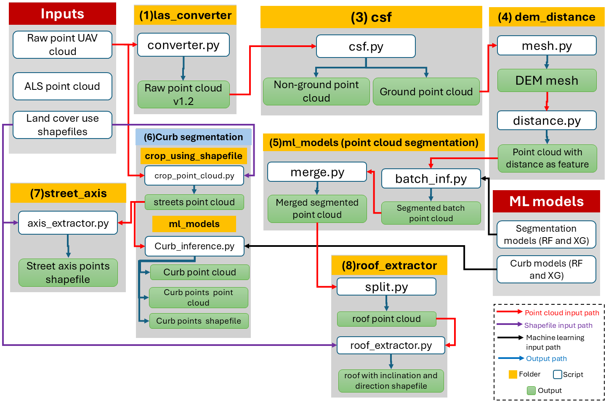

# ZIM-UAV
# TO DO
   - CLEAN REQUIREMENTS.TXT
   - CREATE CONFIG FOR FUSION SCRIPTS
   - FINISH MANUAL/DOCUMENTATION
   - RECORD VIDEOS TUTORIALS 
# zim-docker branch
   - docker version of the scripts
     
## README 
### Requirements (SHOULD CHANGE AFTER DOCKER)
  - Ubuntu (22.04 or higher) or other ubuntu based linux distro  
  - 64 Gb of ram memory
  - 10 core cpu

## Prepare the environment:
Install requirements.txt

## LINKS
### Trained machine learning models 
*Unzip and move to ml_models inside trained_model* - https://drive.google.com/drive/folders/1xf2zbsAkCs0hcVg_DN4VSUq97cG_UQiT?usp=sharing

### Inputs
https://drive.google.com/file/d/1sluPMnnmLhc2uI2tRNhSj5xFLI_hUKvo/view?usp=sharing

### Processed output for Poppenhausen and Maibach 
https://drive.google.com/file/d/1WEf3h2FaQrkC9usf_iB0dXyZDlOHbtB3/view?usp=sharing

### Curb training data
https://drive.google.com/file/d/1ATJL4guH_aOd5gyDWZ-397BUKv2CleRS/view?usp=sharing

### Tutorial
  - tutorial.pdf
    

## Repository Structure

- **`input`**  
  Contains the raw input point clouds and shapefiles provided by **Fraunhofer**.

- **`crop_using_shapefile`**  
  Scripts to crop point clouds using shapefiles provided by Fraunhofer as spatial constraints.

- **`csf`**  
  Implements the **Cloth Simulation Filter (CSF)** to separate ground points from non-ground points in the point cloud.

- **`dem_distance`**  
  Used to generate a **DEM** from ground points and to compute the distance of each point in the point cloud to the DEM.  
  This distance is used as a feature for machine learning models.

- **`downsample`**  
  Tools to downsample point clouds to reduce data size and processing time.

- **`fusion`**  
  Used to merge **ALS** and **UAV** DEMs based on the segmentation results of the point cloud.

- **`las_converter`**  
  Converts point cloud LAS files to version **1.2** to improve compatibility with external libraries and simplify processing.

- **`ml_models`**  
  Contains scripts and configurations to train and run machine learning models for **segmentation** and **curb mapping**.

- **`roof_extractor`**  
  Uses the segmented point cloud and roof shapefiles provided by Fraunhofer to extract individual roof planes, including their **inclination** and **orientation**.

- **`street_axis`**  
  Uses the street point cloud and street shapefiles provided by Fraunhofer to extract **street axis points with elevation**.

- **`output`**  
